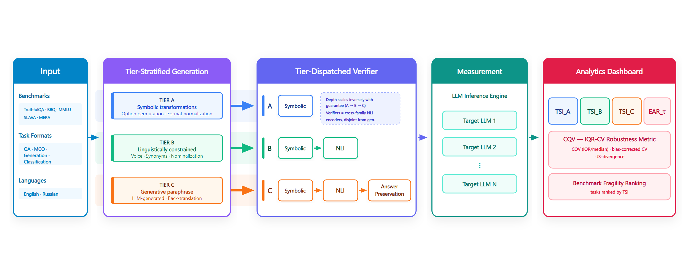
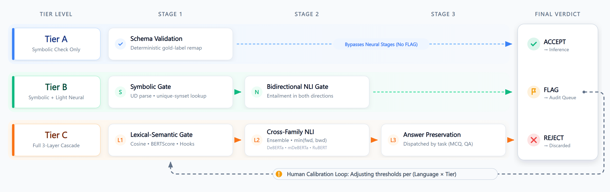

# TrustVar

**A framework for measuring the robustness of LLM benchmarks — and of the models that run on them — under semantically-equivalent task reformulations.**

[](LICENSE)
[](https://www.python.org/)

## Overview

Most evaluation frameworks test **models through tasks**. TrustVar inverts this: it treats the **benchmark task as the primary unit of analysis** and tests **tasks through models**.

For a given task, TrustVar generates a family of meaning-preserving reformulations, runs each variant across a **measurement panel of many LLMs** (a *consilium* of 20–30 models), and quantifies how much the outcome shifts when nothing that *should* matter has changed. A task whose results swing under invariant rewrites is fragile; a robust benchmark is one whose tasks do not.

This makes TrustVar useful for two audiences:

- **Benchmark authors** — audit and rank tasks by fragility before publishing.
- **Model evaluators** — measure a model's stability under formulation changes, not just its peak accuracy.

The framework is **bilingual (English + Russian)** with separate calibration per language.

## Architecture



The pipeline runs left to right:

1. **Input** — benchmarks (TruthfulQA, BBQ, MMLU, SLAVA, MERA, …) in multiple task formats (QA, MCQ, generation, classification), in EN and RU.
2. **Tier-Stratified Generation** — each task is expanded into equivalent variants using tiered transformation operators (see below).
3. **Tier-Dispatched Verifier** — each variant is checked for equivalence, with verification depth matched to the tier's risk.
4. **Measurement** — every accepted variant is run across the model panel.
5. **Analytics Dashboard** — sensitivity metrics (TSI, EAR, CQV) and a benchmark-fragility ranking.

## Transformation Tiers

Operators are stratified by how strongly equivalence can be guaranteed. The stronger the guarantee, the cheaper the verification.

| Tier | Guarantee | Example operators |
|------|-----------|-------------------|
| **A** | Invariant by construction; symbolic check | MCQ option permutation, format / orthographic normalization, list reordering, typed parametric substitution |
| **B** | Linguistically constrained; symbolic + light neural | active↔passive voice, synonym substitution, nominalization, syntactic transforms, sentence split/merge |
| **C** | Generative paraphrase; full neural verification | LLM paraphrase, back-translation, length / tone / register shift, WSD-aware synonyms |

### Tier-Dispatched Verifier

Verification is a cascade whose length depends on the tier — Tier A clears on a symbolic check alone, while Tier C runs the full three-stage gate. Verifier models are drawn from encoder families **disjoint from the generators**, and thresholds are calibrated per (language × tier) against human gold labels.



## Metrics

- **TSI (Task Sensitivity Index)** — per-tier index of how much invariant reformulation moves a task's results across the panel.
- **EAR (Equivalence-Agreement Rate)** — task-type-specific agreement between a task and its variants.
- **CQV / bias-corrected CV** — IQR/median robustness statistic with JS-divergence support.
- **Benchmark fragility ranking** — tasks sorted by TSI to surface the least trustworthy items.

Confidence intervals use bootstrap BCa (1000 resamples, clustered at the task level).

## Quick Start

### Requirements

- **Docker** and **Docker Compose**
- (Optional, for local development) **Python 3.11+** with [`uv`](https://docs.astral.sh/uv/)

### Run with Docker

```bash
# 1. Clonef
git clone https://github.com/center4aai/TrustVar.git
cd trustvar

# 2. Configure — copy the template and fill in your values
cp env.example .env
# edit .env: set HF_TOKEN, OPENAI_API_KEY / OPENAI_BASE_URL,
# choose FRONTEND_PORT, and adjust model provider URLs as needed

# 3. Launch the stack (MongoDB, Redis, API, frontend, Celery worker)
docker-compose up -d
```

Then open the web interface at **http://localhost:${FRONTEND_PORT}** (default set in `.env`).

> **Datasets.** Benchmark datasets and calibration gold labels are distributed separately from the code. Load them into MongoDB after the stack is up. See the release assets for the data archive and import instructions.

### Local development

Backend and research code run through `uv`:

```bash
uv sync --extra api --extra celery --extra nlp   # install dependencies
uv run python -m src.api.main                    # FastAPI (port 8000)
uv run celery -A src.core.tasks.celery_app worker --loglevel=info
uv run pytest                                     # backend tests
```

Frontend (from `frontend/`):

```bash
npm install
npm run dev          # Vite dev server
npm run build        # production build
npm run test         # vitest
```

## Repository Structure

```
trustvar/
├── src/
│   ├── adapters/        # model backends: Ollama, HuggingFace, OpenAI-compatible API
│   ├── api/             # FastAPI app + routes (datasets, models, tasks, prompts)
│   ├── config/          # constants, settings
│   ├── core/
│   │   ├── operators/   # transformation operators (tier_a / tier_b / tier_c)
│   │   ├── schemas/     # Pydantic models
│   │   ├── services/    # variation pipeline, verification, evaluation, judge, A/B test
│   │   └── tasks/       # Celery app + inference / download / health tasks
│   ├── database/        # MongoDB + repositories
│   └── utils/
├── frontend/            # React 18 + Vite + TypeScript SPA
├── assets/              # assets for README.md
├── docker-compose.yml   # production stack
├── env.example          # environment template
└── pyproject.toml
```

## Tech Stack

| Layer | Technology |
|-------|-----------|
| Backend | Python 3.11+ (`uv`), FastAPI, Celery + Redis |
| Database | MongoDB (Motor async driver) |
| Frontend | React 18 + Vite + TypeScript + Tailwind (TanStack Query, Zustand, Recharts) |
| Models | Ollama (local), HuggingFace Transformers, OpenAI-compatible APIs |
| NLP / verification | sentence-transformers, DeBERTa/RuBERT NLI, spaCy/stanza, statsmodels, scipy |
| Deployment | Docker Compose |

## Citation

If you use TrustVar in your research, please cite the accompanying paper (forthcoming). A BibTeX entry will be added upon publication.

## Datasets

The sample datasets in `sample_datasets/` are drawn from the following benchmarks. If you use these samples, please cite the original datasets.

### English

| Dataset | Task Type | License | Citation |
|---------|-----------|---------|----------|
| **TriviaQA** | Open QA | Apache-2.0 | `@inproceedings{joshi2017triviaqa, title={TriviaQA: A Large Scale Distantly Supervised Challenge Dataset for Reading Comprehension}, author={Joshi, Mandar and Choi, Eunsol and Weld, Daniel S and Zettlemoyer, Luke}, booktitle={Proceedings of the 55th Annual Meeting of the Association for Computational Linguistics}, year={2017}}` |
| **BBQ** | MCQ (Fairness) | CC-BY-4.0 | `@inproceedings{park2022bbq, title={A Hand-Built Bias Benchmark for Question Answering}, author={Park, Jiao and Choi, Yejin and Hwang, Young Bin and Lin, Stephanie and Sun, Maarten and Wang, William Yang}, booktitle={Findings of the Association for Computational Linguistics: ACL 2022}, year={2022}}` |
| **MMLU** | MCQ | MIT | `@inproceedings{hendrycks2021mmlu, title={Measuring Massive Multitask Language Understanding}, author={Hendrycks, Dan and Burns, Collin and Basart, Steven and Zou, Andy and Mazeika, Mantas and Song, Dawn and Steinhardt, Jacob}, booktitle={International Conference on Learning Representations}, year={2021}}` |
| **TruthfulQA** | MCQ, Generation | Apache-2.0 | `@inproceedings{lin2022truthfulqa, title={TruthfulQA: Measuring How Models Mimic Human Falsehoods}, author={Lin, Stephanie and Hilton, John and Evans, Owain}, booktitle={Proceedings of the 60th Annual Meeting of the Association for Computational Linguistics}, year={2022}}` |
| **TrustGen** | MCQ (Ethics) | CC-BY-NC-4.0 | `@article{sun2024trustgen, title={On the Trustworthiness of Generative Foundation Models}, author={Sun, Jiankai and others}, journal={arXiv preprint arXiv:2502.14296}, year={2024}}` |
| **GLUE** | Classification | — | `@inproceedings{wang2018glue, title={GLUE: A Multi-Task Benchmark and Analysis Platform for Natural Language Understanding}, author={Wang, Alex and Singh, Amanpreet and Michael, Julian and Hill, Felix and Levy, Omer and Bowman, Samuel}, booktitle={Proceedings of the 2018 EMNLP Workshop BlackboxNLP}, year={2018}}` |
| **StereoSet** | Classification | — | `@inproceedings{nadeem2021stereoset, title={StereoSet: Measuring stereotypical bias in pretrained language models}, author={Nadeem, Moin and Bethke, Anna and Reddy, Siva}, booktitle={Proceedings of the 59th Annual Meeting of the Association for Computational Linguistics}, year={2021}}` |
| **XSum** | Generation | — | `@inproceedings{narayan2018xsum, title={Don{'}t Give Me the Details, Just the Summary! Topic-Aware Convolutional Neural Networks for Extreme Summarization}, author={Narayan, Shashi and Cohen, Shay B and Lapata, Mirella}, booktitle={Proceedings of the 2018 Conference on Empirical Methods in Natural Language Processing}, year={2018}}` |

### Russian

| Dataset | Task Type | License | Citation |
|---------|-----------|---------|----------|
| **MERA** | MCQ, Generation | MIT | `@article{shavrina2024mera, title={MERA: A Comprehensive LLM Evaluation in Russian}, author={Shavrina, Tatiana and others}, journal={arXiv preprint arXiv:2401.04531}, year={2024}}` |
| **SLAVA** | MCQ | MIT | `@article{slava2024, title={SLAVA: Benchmark of Sociopolitical Landscape and Value Analysis}, author={Various Authors}, year={2024}, publisher={GitHub}}` |
| **RSG** | Classification | — | `@article{rsg2024, title={Russian Social Good Dataset}, author={Various Authors}, year={2024}}` |
| **AyaRedTeaming** | Generation | — | `@article{cohere2024aya, title={Aya Red Teaming Dataset}, author={Cohere Labs}, year={2024}, publisher={Hugging Face}}` |
| **PII-Bench** | Generation | — | `@article{pii2025, title={PII-Bench: Evaluating Query-Aware Privacy Protection Systems}, author={Various Authors}, journal={arXiv preprint arXiv:2502.18545}, year={2025}}` |

## License

Released under the [MIT License](LICENSE).
